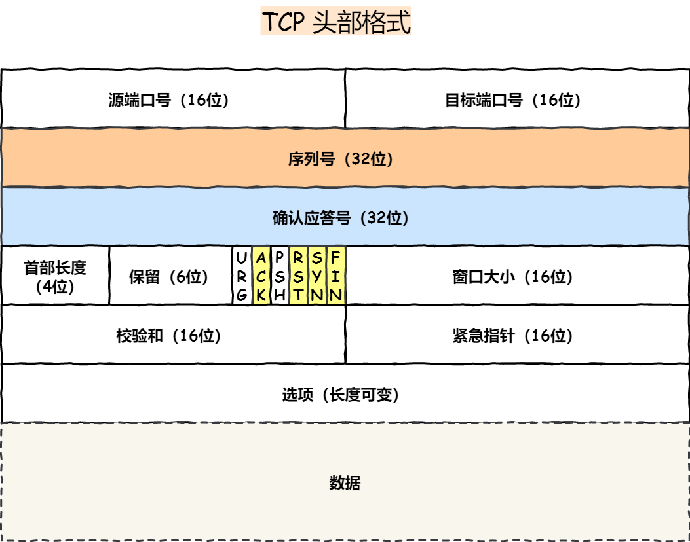
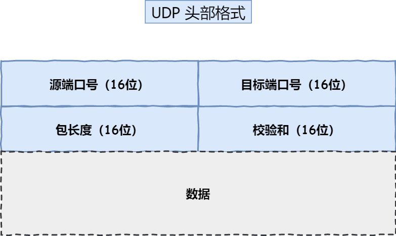
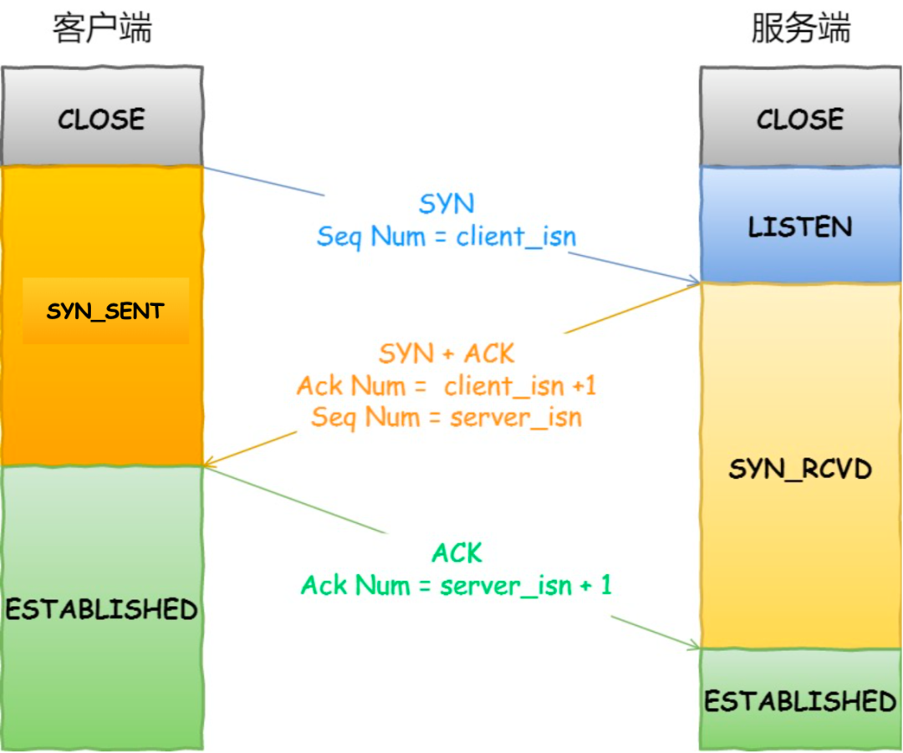
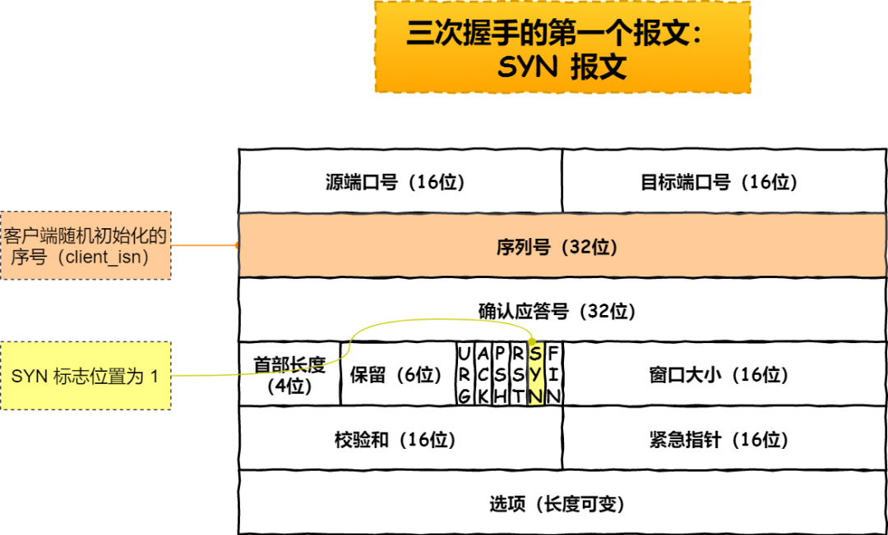
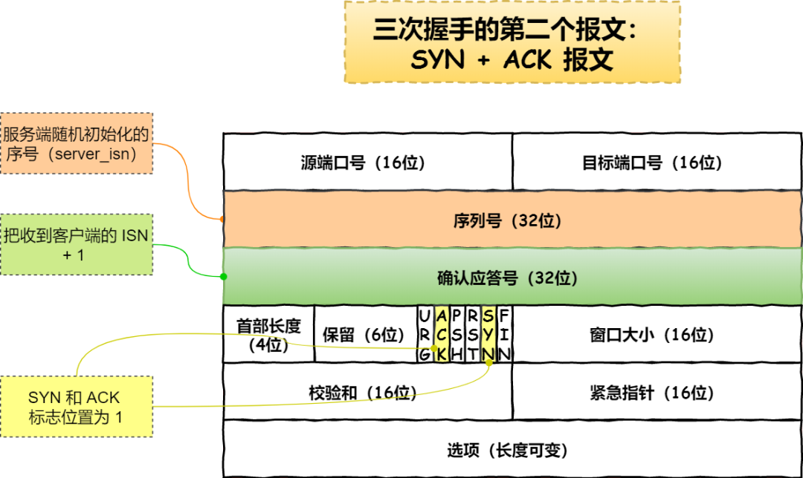
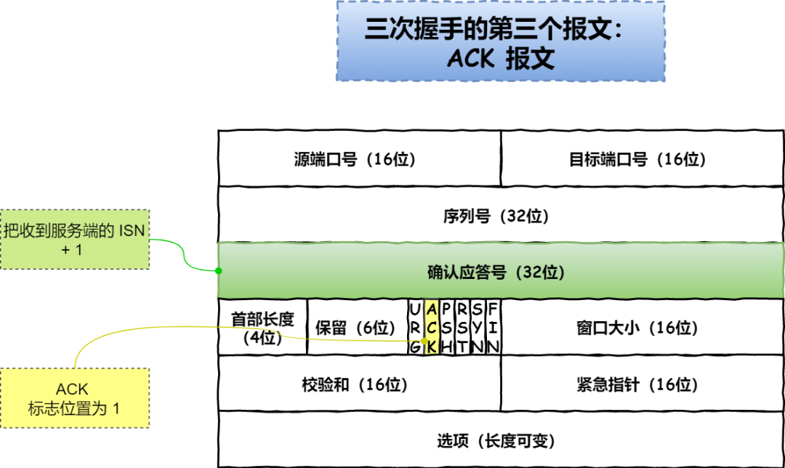
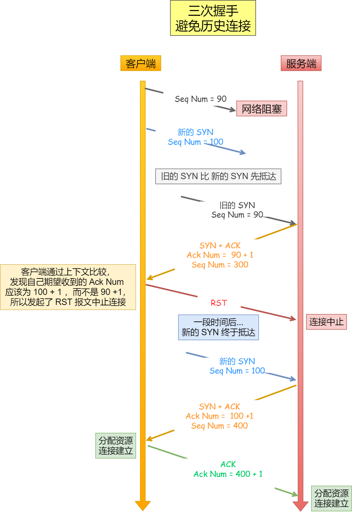
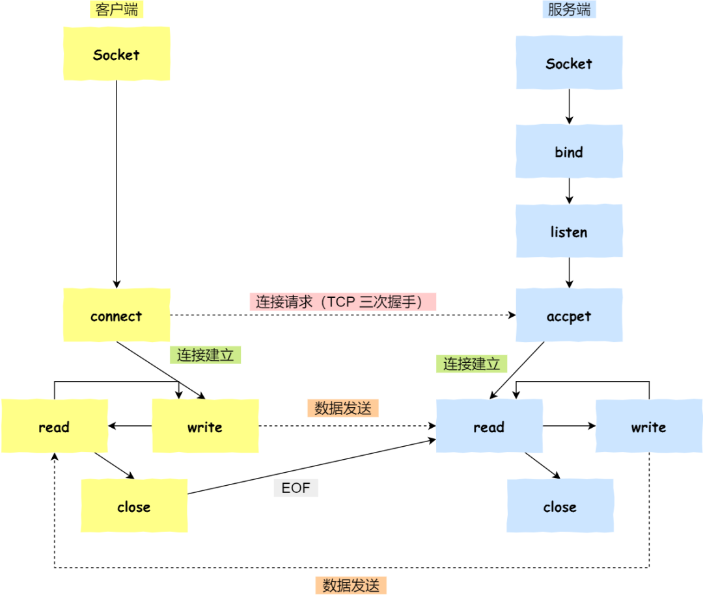

<!--
 * @Author: yao fanghao
 * @Date: 2023-04-14 22:13:52
 * @LastEditTime: 2023-04-23 11:08:03
 * @LastEditors: yao fanghao
-->
# 参考资料

* 网络是怎样连接的
* 计算机网络-自顶向下方法
* 计算机网络-谢希仁
* 王道-计算机网络
* <https://mp.weixin.qq.com/s/M1ZuZPdKnoXEpBmdNFgmZQ>
  
# TCP基本认识

* 
* 序列号：解决网络包乱序问题
* 确认应答号：解决丢包问题
* 控制位：
  * ACK
  * RST
  * SYN
  * FIN
* 

# TCP三次握手

* 
* 
* 
* 
* 第三次握手可以携带数据，前两次握手不可以携带数据
* netstat -napt 命令查看TCP连接状态
* 三次握手才可以阻止重复历史连接的初始化（主要原因）
* 
* 三次握手才可以同步双方的初始序列号
* 三次握手才可以避免资源浪费

# Socket编程

* 
