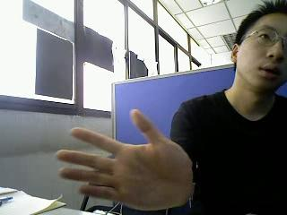
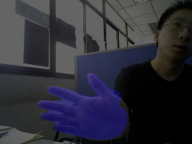
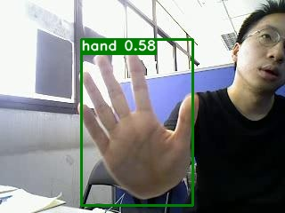

# Paddle训练自己的模型并部署到arm设备上

## PaddleX-语义分割demo文件夹
### 基于PaddleX的语义分割示例代码
* **以FastSCNN为例**：
* 简单的示例代码见 https://aistudio.baidu.com/aistudio/projectdetail/4434443
  * 105张图片，手部检测分割
### 1-数据集制作
* Labelme标注，用json_to_dataset.py和get_jpg_and_png.py进行处理，得到标注的png图片
* 数据集参考格式见**dataset/VOChand文件夹**
  * 内含：
    * JPEGImages文件夹
    * Annotations文件夹
  * **注意！Annotations中图片如果为24位，需要运行24to8.py转换为单通道，否则后续无法训练**
* 运行**seg_split.py**
  * 参考官方代码并做适当改动： https://github.com/PaddlePaddle/PaddleX/blob/07ceb75823fd9d4eb1aa9e5fd93ab636e801507c/paddlex/tools/dataset_split/seg_split.py    
  * 得到以下四个txt：
    * labels.txt
    * test_list.txt
    * train_list.txt
    * val_list.txt
### 2-模型训练
* 示例代码：
```python
import paddlex as pdx
from paddlex import transforms as T

# 下载和解压视盘分割数据集
# optic_dataset = 'https://bj.bcebos.com/paddlex/datasets/optic_disc_seg.tar.gz'
# pdx.utils.download_and_decompress(optic_dataset, path='./')

# 定义训练和验证时的transforms
# API说明：https://github.com/PaddlePaddle/PaddleX/blob/develop/docs/apis/transforms/transforms.md
train_transforms = T.Compose([
    T.Resize(target_size=512),
    T.RandomHorizontalFlip(),
    T.Normalize(
        mean=[0.5, 0.5, 0.5], std=[0.5, 0.5, 0.5]),
])
eval_transforms = T.Compose([
    T.Resize(target_size=512),
    T.Normalize(
        mean=[0.5, 0.5, 0.5], std=[0.5, 0.5, 0.5]),
])

# 定义训练和验证所用的数据集
# API说明：https://github.com/PaddlePaddle/PaddleX/blob/develop/docs/apis/datasets.md
train_dataset = pdx.datasets.SegDataset(
    data_dir='MyHandData/816/VOChand',
    file_list='MyHandData/816/VOChand/train_list.txt',
    label_list='MyHandData/816/VOChand/labels.txt',
    transforms=train_transforms,
    shuffle=True)
eval_dataset = pdx.datasets.SegDataset(
    data_dir='MyHandData/816/VOChand',
    file_list='MyHandData/816/VOChand/val_list.txt',
    label_list='MyHandData/816/VOChand/labels.txt',
    transforms=eval_transforms,
    shuffle=False)

# 初始化模型，并进行训练
# 可使用VisualDL查看训练指标，参考https://paddlex.readthedocs.io/zh_CN/develop/train/visualdl.html
num_classes = len(train_dataset.labels)
# API说明：https://paddlex.readthedocs.io/zh_CN/develop/apis/models/semantic_segmentation.html#paddlex-seg-fastscnn
model = pdx.seg.FastSCNN(num_classes=num_classes)

# API说明：https://paddlex.readthedocs.io/zh_CN/develop/apis/models/semantic_segmentation.html#train
# 各参数介绍与调整说明：https://paddlex.readthedocs.io/zh_CN/develop/appendix/parameters.html
model.train(
    num_epochs=20,
    train_dataset=train_dataset,
    train_batch_size=8,
    eval_dataset=eval_dataset,
    learning_rate=0.01,
    save_dir='output/fastscnn',
    use_vdl=True)
```
### 3-模型简单的预测和可视化
```python
#模型预测
model = pdx.load_model('output/fastscnn/best_model')
image_name = 'output/118.jpg'
result = model.predict(image_name)
pdx.seg.visualize(image_name, result, weight=0.4, save_dir='output/fastscnn')

# 显示图像
%matplotlib inline
import matplotlib.pyplot as plt
import matplotlib.image as mpimg
f1='output/118.jpg'
f2="output/fastscnn/visualize_118.jpg"
# f3="facade/images/spatial_envelope_256x256_static_8outdoorcategories__street_urb206.jpg"
# f4="output/fastscnn/visualize_spatial_envelope_256x256_static_8outdoorcategories__street_urb206.jpg"
img1=mpimg.imread(f1)
img2=mpimg.imread(f2)
# img3=mpimg.imread(f3)
# img4=mpimg.imread(f4)
plt.subplot(211)
plt.imshow(img1)
plt.subplot(212)
plt.imshow(img2)
# plt.subplot(223)
# plt.imshow(img3)
# plt.subplot(224)
# plt.imshow(img4)
plt.show()
```
* 
* 

-------------------

## PaddleX-目标检测demo文件夹
### 基于PaddleX的目标检测示例代码
* **以YOLOv3-Mobilenetv1为例**：
* 简单的示例代码见 https://aistudio.baidu.com/bd-gpu-01/user/1054847/4440808/notebooks/4440808.ipynb
  * 105张图片，手部目标检测
### 1-数据集制作
* Labelimg标注
* 数据集参考格式见**dataset文件夹**
  * 内含：
    * JPEGImages文件夹
    * Annotations文件夹
* 运行**voc_split.py**
  * 参考官方代码并做适当改动： https://github.com/PaddlePaddle/PaddleX/blob/07ceb75823fd9d4eb1aa9e5fd93ab636e801507c/paddlex/tools/dataset_split/voc_split.py  * 得到以下四个txt：
    * labels.txt
    * test_list.txt
    * train_list.txt
    * val_list.txt
### 2-模型训练
* 示例代码：
```python
# 设置使用0号GPU卡（如无GPU，执行此代码后仍然会使用CPU训练模型）
import matplotlib
matplotlib.use('Agg') 
import os
os.environ['CUDA_VISIBLE_DEVICES'] = '0'
import paddlex as pdx
# coding:utf-8
from paddlex import transforms as T

# 定义训练和验证时的transforms
train_transforms = T.Compose([
     T.BatchRandomResize(
         target_sizes=[
             320, 352, 384, 416, 448, 480, 512, 544, 576, 608, 640, 672, 704,
             736, 768
         ],
         interp='RANDOM'), T.Normalize(
             mean=[0.485, 0.456, 0.406], std=[0.229, 0.224, 0.225])
])
eval_transforms = T.Compose([
    T.Resize(
        target_size=640, interp='CUBIC'), T.Normalize(
            mean=[0.485, 0.456, 0.406], std=[0.229, 0.224, 0.225])
])

# 定义训练和验证所用的数据集
train_dataset = pdx.datasets.VOCDetection(
    data_dir='dataset/dataset',
    file_list='dataset/dataset/train_list.txt',
    label_list='dataset/dataset/labels.txt',
    transforms=train_transforms,
    num_workers=0,
    shuffle=True)
eval_dataset = pdx.datasets.VOCDetection(
    data_dir='dataset/dataset',
    file_list='dataset/dataset/val_list.txt',
    label_list='dataset/dataset/labels.txt',
    transforms=eval_transforms,
    num_workers=0,
    shuffle=False)

# 初始化模型，并进行训练
# API说明: https://paddlex.readthedocs.io/zh_CN/develop/apis/models/detection.html#paddlex-det-yolov3
num_classes = len(train_dataset.labels)
model = pdx.det.YOLOv3(num_classes=num_classes, backbone='MobileNetV1')
model.train(
    num_epochs=270,
    train_dataset=train_dataset,
    train_batch_size=8,
    eval_dataset=eval_dataset,
    pretrain_weights='COCO',
    learning_rate=0.001 / 4,
    warmup_steps=1000,
    warmup_start_lr=0.0,
    lr_decay_epochs=[216, 243],
    save_interval_epochs=3,
    save_dir='output/yolov3_mobilenetv1_coco')
```
### 3-模型简单的预测和可视化
```python
#模型预测
import paddlex as pdx
model = pdx.load_model('output/yolov3_mobilenetv1_coco/best_model')
image_name = '177.jpg'
result = model.predict(image_name)
pdx.det.visualize(image_name, result, threshold=0.5, save_dir='./output')

# 显示图像
%matplotlib inline
import matplotlib.pyplot as plt
import matplotlib.image as mpimg
f1='177.jpg'
f2="output/visualize_177.jpg"
# f3="facade/JPEGImages/spatial_envelope_256x256_static_8outdoorcategories__street_urb206.jpg"
# f4="output/fastscnn/visualize_spatial_envelope_256x256_static_8outdoorcategories__street_urb206.jpg"
img1=mpimg.imread(f1)
img2=mpimg.imread(f2)
# img3=mpimg.imread(f3)
# img4=mpimg.imread(f4)
plt.subplot(211)
plt.imshow(img1)
plt.subplot(212)
plt.imshow(img2)
# plt.subplot(223)
# plt.imshow(img3)
# plt.subplot(224)
# plt.imshow(img4)
plt.show()
```
* 
* 

-------------------

## 模型部署
### 部署模型导出
* 参考 https://paddlex.readthedocs.io/zh_CN/release-1.3/deploy/export_model.html
* 首先需要有训练得到的best_model文件夹，其中包括：
  * **model.pdparams**
  * **model.yml**
  * **model.pdopt**

* C++进行模型预测的小例子
* 推理库安装 https://www.paddlepaddle.org.cn/inference/master/guides/install/download_lib.html#windows
* 快速上手 https://www.paddlepaddle.org.cn/inference/master/guides/quick_start/cpp_demo.html
* 语义分割示例 https://github.com/PaddlePaddle/PaddleX/blob/release/1.3/deploy/cpp/demo/segmenter.cpp

### PaddleX树莓派部署 
* https://github.com/PaddlePaddle/PaddleX/blob/develop/deploy/cpp/docs/deployment.md

### 转换为.nb格式（不确定能否在arm工控机上使用）

* 参考网站 https://paddlepaddle.github.io/Paddle-Lite/
* paddle-lite版本 https://github.com/PaddlePaddle/Paddle-Lite/releases


* 示例：
* 在命令行终端输入，得到inference_model文件夹：
```
paddlex --export_inference --model_dir=output/fastscnn/best_model --save_dir=inference_model2
```
* 随后在命令行终端输入，得到nb格式的模型：
```
paddle_lite_opt --model_dir=inference_model/inference_model --optimize_out=fastscnn_opt --optimize_out_type=naive_buffer --valid_target=arm
```

* paddle-lite 

### 重点！基于C++ API落地轻量化模型
* https://github.com/PaddlePaddle/Paddle-Lite
