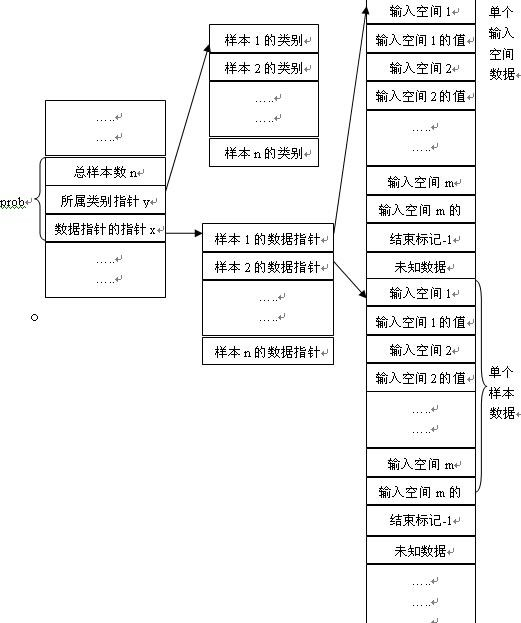

# 基于C++的SVM模型的简单实现
* 2022.11.25起-
* 本项目是简单的二分类问题，输入火焰的红外、紫外、图像等多种融合特征，**输出0或1（表示无/有火）**
  
## 参考资料：
* https://www.csie.ntu.edu.tw/~cjlin/libsvm/
* https://blog.csdn.net/jsgaobiao/article/details/50202757

## 实现过程
* 实现在main.cpp，编译**需包含svm.cpp和svm.h文件**
* 数据集
  * train.txt 训练集和验证集
* 数据清理
  * 避免各类特征值权重对模型的影响，以及防止训练时数值计算的困难，将输入特征统一**归一化**到[0,1]之间
* 调用方法和参数说明--不清楚的设置参数先选择默认值
  * **svm_model 为模型类**，通过训练或加载训练好的模型文件获得
  * **svm_parameter 为参数类**，主要为支持向量机设定参数，具体参数如下：
    ```cpp
    svm_parameter.svm_type
    svm类型：SVM设置类型(默认svm_parameter.C_SVC)
    svm_parameter.C_SVC -- C-SVC
    svm_parameter.NU_SVC -- ν-SVC
    svm_parameter.ONE_CLASS – 一类SVM
    svm_parameter.EPSILON_SVR -- ε -SVR
    svm_parameter.NU_SVR -- ν-SVR

    svm_parameter.kernel_type
    核函数类型：核函数设置类型(svm_parameter.LINEAR)
    svm_parameter.LINEAR – 线性：u'×v
    svm_parameter.POLY– 多项式：(γ×u'×v + coef0)^degree
    svm_parameter.RBF – RBF函数：exp(-γ×|u-v|^2)
    svm_parameter.SIGMOID – sigmoid：tanh(γ×u'×v + coef0)

    svm_parameter.degree
    核函数中的degree设置(默认3)

    svm_parameter.coef0
    核函数中的coef0设置(默认0)

    svm_parameter.shrinking
    是否使用启发式，0或1(默认1)

    svm_parameter.nu
    设置ν-SVC，一类SVM和ν- SVR的参数(默认0.5)

    svm_parameter.C
    设置C-SVC，ε -SVR和ν-SVR的参数(默认1)

    svm_parameter.cache_size
    设置cache内存大小，以MB为单位(默认40)
    ```
  * svm_problem 相当于训练集合，可讲需要训练的数据加入该类传递给训练器
* 其他说明
  * 参数prob是svm_problem类型数据，具体结构定义如下：   
    ```cpp
    struct svm_model *svm_train(const struct svm_problem *prob, const struct svm_parameter *param);

    struct svm_problem //存储本次参加运算的所有样本(数据集)，及其所属类别。
    {
    int n; //记录样本总数
    double *y; //指向样本所属类别的数组
    struct svm_node **x; //指向一个存储内容为指针的数组
    };
    其中svm_node的结构体定义如下：
    struct svm_node //用来存储输入空间中的单个特征
    {
    int index; //输入空间序号，假设输入空间数为m
    double value; //该输入空间的值
    };
    ```
   
* 两个核心函数
  * **struct svm_model *svm_train(const struct svm_problem *prob, const struct svm_parameter *param)**。设定好参数之后，运行改函数，该函数返回一个struct svm_model *SVM模型的指针，可以使用svm_save_model(const char *model_file_name, const struct svm_model *model)函数，把这个模型保存在磁盘中。
  * **double svm_predict(const struct svm_model *model, const struct svm_node *x)**。参数model，是一个SVM模型的指针，可以使用函数struct svm_model *svm_load_model(const char *model_file_name)，导入训练时保存好的SVM模型，此函数返回一个SVM模型的指针，可以直接赋值给变量model。该函数返回一个double类型，指明被预测数据属于哪个类。面对两分类问题的时候，**通常使用+1代表正样本，即类1；-1代表负样本，即类2**。根据返回的double值就可以知道预测数据的类别。
* 查看模型
  * 模型信息保存至model.txt
* 补充资料
  * SVM是一个二分类器，当遇到多类别的时候，一般采取如下两种策略。 
  a.一对多法（one-versus-rest,简称1-v-r SVMs）。训练时依次把某个类别的样本归为一类,其他剩余的样本归为另一类，这样k个类别的样本就构造出了k个SVM。分类时将未知样本分类为具有最大分类函数值的那类。
  b.一对一法（one-versus-one,简称1-v-1 SVMs）。其做法是在任意两类样本之间设计一个SVM，因此k个类别的样本就需要设计k(k-1)/2个SVM。当对一个未知样本进行分类时，最后得 票最多的类别即为该未知样本的类别。Libsvm中的多类分类就是根据这个方法实现的

* csv批量合并的command指令：
  * copy *.csv all.csv
* csv转excel格式工具
  * https://tableconvert.com/zh-cn/csv-to-excel
* excel转txt格式工具
  * https://cdkm.com/cn/xls-to-txt