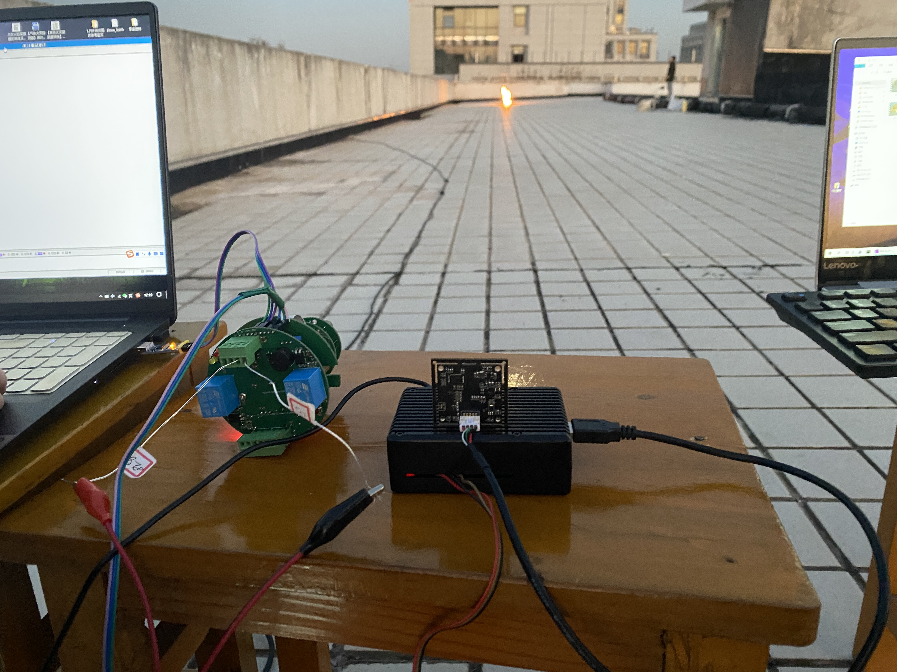
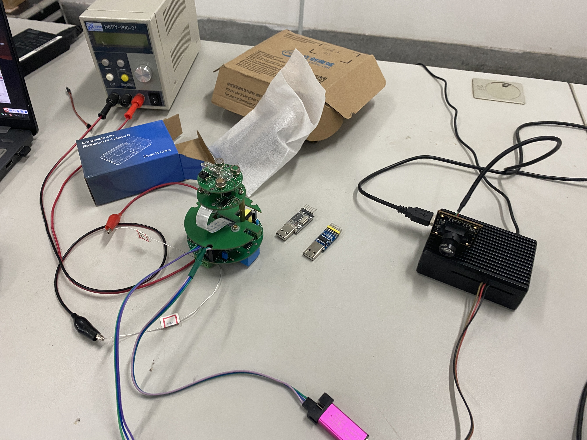
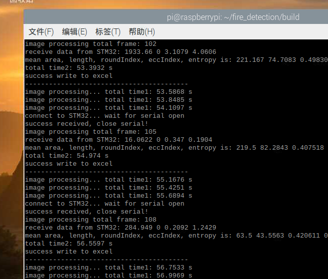
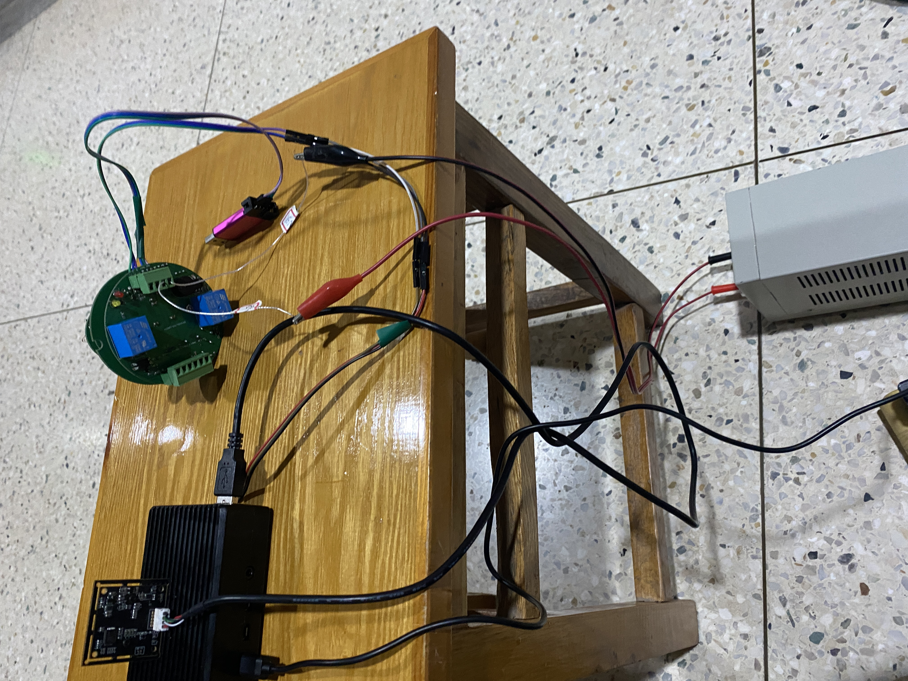

# fire detection / C++ / RaspberryPi-4B

2022.6.1-2022.12.31

## 简介

基于 OpenCV + C++ 的火焰检测项目，部署于树莓派 4B，结合 STM32 串口通信和 SVM 分类器实现多特征融合的火焰识别。

## 项目结构

```
fireDetection/
├── _img/                         # 项目结果示例图片
│   ├── demo1.png
│   ├── demo2.jpg
│   ├── demo3.jpg
│   └── demo4.jpg
│
├── cascade_data/                 # 级联分类器训练数据 (Haar/LBP)
│   ├── data/                     # 训练输出：cascade.xml、stage0~6.xml
│   ├── 转换为灰度图.py           # 训练样本预处理
│   ├── creatsamples.bat          # 创建正样本
│   ├── traincascade.bat          # 训练级联分类器
│   └── yinshe.py                 # 映射处理脚本
│
├── CppSVM/                       # SVM 分类器模型
│   ├── SVM-本项目/               # 本项目使用的 SVM（train.cpp / predict.cpp）
│   │   ├── train.cpp             # 模型训练
│   │   ├── predict.cpp           # 模型预测
│   │   ├── svm.cpp / svm.h       # libsvm 核心代码
│   │   ├── train.txt             # 训练集
│   │   └── README.md             # SVM 实现说明
│   └── SVM-参考版/               # 参考实现的 SVM 版本
│
├── external_module/              # 外部依赖模块
│   ├── easylogging++.h / .cc     # 日志库 (https://github.com/amrayn/easyloggingpp)
│   ├── WzSerialPort.h / .cpp     # 串口通信库
│   └── CMakeLists.txt            # 外部模块编译配置
│
├── Simple-RasberryPi/            # 树莓派部署版本
│   ├── external_module/          # 同上的外部依赖
│   ├── CMakeLists.txt            # 交叉编译 CMake 配置
│   ├── main-1.0.cpp              # v1.0 摄像头火焰检测
│   ├── main-2.0.cpp              # v2.0 改进版
│   ├── main-12.3版-可以但串口读取太卡.cpp  # 带串口的实验版
│   ├── main-只录视频.cpp          # 纯录视频测帧率
│   ├── config.txt                # 树莓派配置
│   ├── ssh                       # 启用 SSH 空文件
│   └── wpa_supplicant.conf       # WiFi 配置
│
├── test_code/                    # 测试与辅助代码
│   ├── 图像处理测试/             # Python 图像处理脚本
│   │   ├── 裁剪出样本.py         # 图像裁剪
│   │   ├── 几种二值化方法的代码.py
│   │   ├── 计算周长面积.py
│   │   ├── 开运算.py / getHSV.py / demo.py
│   │   ├── 去除灯图像上的反光.py
│   │   ├── 视频截帧.py / 图片合成为视频.py
│   │   ├── 鼠标点击获取坐标值.py
│   │   └── hsv_param.md          # HSV 参数说明
│   ├── 数据分析/                 # 特征数据分析
│   │   ├── MATLAB分析数据集/     # MATLAB 分析脚本与图表
│   │   ├── python分析数据集/     # Python 分析脚本与图表
│   │   ├── video_process/        # 视频处理脚本
│   │   └── fire数据统计分析.ipynb # 火焰特征数据分析 Jupyter 笔记
│   ├── fireDetection-完整版-不包含串口通信.cpp  # 完整版（无串口）
│   └── main-干扰对照组参数测试.cpp            # 干扰项数据集制作
│
├── fire-摄像头实时火焰检测简化版.cpp   # 简化版：实时摄像头检测，无日志/串口
├── fireCascade.cpp                 # 级联分类器检测方法
├── fireCascadeDetection.h          # 级联分类器头文件
├── cascade.xml                     # 训练好的级联分类器模型
├── main-双线程.cpp                 # 双线程版：图像处理 + 串口通信 (semaphore)
├── PV双线程-图像处理及串口通信.cpp  # PV信号量双线程同步示例代码
├── README.md                       # 本文件
├── fireDetection.sln / .vcxproj    # Visual Studio 项目配置
└── opencv_455_release_win64.props  # OpenCV 属性表
```

## 部分代码说明

* 初始化日志模块 -2022.8

```cpp
// log setting
// https://github.com/amrayn/easyloggingpp
el::Configurations defaultConf;
defaultConf.setToDefault();
el::Loggers::reconfigureLogger("default", defaultConf);
el::Logger* defaultLogger = el::Loggers::getLogger("default");
```

* 轮廓提取，绘制凸包，计算面积、周长、圆形度、偏心度特征 -2022.11

```cpp
vector<vector<Point>>contours;
vector<Vec4i>hierarchy;
cv::findContours(mask, contours, hierarchy, RETR_LIST, CHAIN_APPROX_SIMPLE);
//cv::drawContours(frame, contours, -1, Scalar(0, 0, 255), 3);
vector<vector<Point>>hull(contours.size()); 

int image_area = frame.rows * frame.cols;
for (size_t i = 0; i < contours.size(); i++)
{
 convexHull(contours[i], hull[i]);   // caculate convexhull

 double area = contourArea(contours[i]);
 double length = arcLength(contours[i], true);
 double roundIndex = 4 * 3.1415926 * area / (length * length + 0.00001);

 if ((area > contours_ratio * image_area) && (roundIndex > round_low) 
 && (length > cntlen_low) && (contours[i].size() > ellipse_low))
 {  
  Rect rect = boundingRect(contours[i]);
  //rectangle(frame, rect, (255, 0, 0), 5);

  RotatedRect box = fitEllipse(contours[i]);
  double ellipseA = box.size.height;
  double ellipseB = box.size.width;
  double eccIndex = sqrt(abs(pow(ellipseA, 2) - pow(ellipseB, 2))) / 2;  // 偏心度 

  string text = "Warning!";
  cv::Point origin;
  origin.x = frame.cols / 2;
  origin.y = frame.rows / 2;
  putText(frame, text, origin, FONT_HERSHEY_SIMPLEX, 1, Scalar(0, 0, 255), 1);
  //putText(frame, std::to_string(ent.val[0]), origin, FONT_HERSHEY_SIMPLEX, 1, Scalar(255, 0, 0), 1);
 }
}

// draw convexhull
for (size_t i = 0; i < contours.size(); i++)
{
//drawContours(mask, contours, (int)i, Scalar(0, 0, 255));
drawContours(frame, hull, (int)i, Scalar(255, 0, 0), 5);
}
```

* 计算图像的熵值 -2022.11.23

```cpp
//https://github.com/arnaudgelas/OpenCVExamples/blob/master/cvMat/Statistics/Entropy/Entropy.cpp
cv::Scalar Entropy(cv::Mat image)
{
 std::vector<cv::Mat> channels;
 cv::split(image, channels);
 int histSize = 256;
 float range[] = { 0, 256 };
 const float* histRange = { range };
 bool uniform = true;
 bool accumulate = false;
 cv::Mat hist0, hist1, hist2;
 cv::calcHist(&channels[0], 1, 0, cv::Mat(), hist0, 1, &histSize, &histRange, uniform, accumulate);
 cv::calcHist(&channels[1], 1, 0, cv::Mat(), hist1, 1, &histSize, &histRange, uniform, accumulate);
 cv::calcHist(&channels[2], 1, 0, cv::Mat(), hist2, 1, &histSize, &histRange, uniform, accumulate);

 //frequency
 float f0 = 0, f1 = 0, f2 = 0;
 for (int i = 0; i < histSize; i++)
 {
  f0 += hist0.at<float>(i);
  f1 += hist1.at<float>(i);
  f2 += hist2.at<float>(i); 
 }

 //entropy
 cv::Scalar e;
 e.val[0] = 0;
 e.val[1] = 0;
 e.val[2] = 0;
 // e0=0, e1=0, e2=0;
 float p0, p1, p2;

 for (int i = 0; i < histSize; i++)
 {
  p0 = abs(hist0.at<float>(i)) / f0;
  p1 = abs(hist1.at<float>(i)) / f1;
  p2 = abs(hist2.at<float>(i)) / f2;
  if (p0 != 0)
   e.val[0] += -p0 * log10(p0);
  if (p1 != 0)
   e.val[1] += -p1 * log10(p1);
  if (p2 != 0)
   e.val[2] += -p2 * log10(p2);
  }
return e;
}
```

* 串口通信的简单实现，读取STM32发送的四个数据（依据空格分割） -2022.11.22

```cpp
WzSerialPort w;
if (w.open("/dev/ttyS0", 115200, 0, 8, 1))
{
 std::cout << "connect to STM32... wait for serial open" << std::endl;

 char buf[1024];   
 std::vector<double> receive_num; 
 while (true)
 {
 memset(buf, 0, 1024);
 w.receive(buf, 1024);
 // cout << buf;   
 char delims[] = " ";
 char* result = NULL;
 char* ptr;
 double ret;
 result = strtok(buf, delims); // 收到的字符串按空格作为割
 int i = 0;
 while (result != NULL) 
 {
  ret = strtod(result, &ptr);
  if (typeid(ret) == typeid(double)) 
  {
  receive_num.push_back(ret);
  i++;
  }
  result = strtok(NULL, delims);

  if (i == 4) 
  {
  // 读完四个数关闭串口，后续可以优化    
  cout << "success received, close serial!" << endl;
  w.close();
  return receive_num;    
  }
  }
 }
}
```

## 实现过程

* 开启摄像头，树莓派成功连接到摄像头设备并能读取到视频流
* 速度设置为：每读取3帧图像进入图像处理模块
* 摄像头获取到的RGB图像，计算其第一个通道的熵值
* 图像膨胀操作
* 将RGB转换为HSV颜色空间
* 针对火焰特征在HSV空间阈值分割，分割完成后是二值化图像mask（掩膜），h范围是0-50，s范围是0-80，v范围是250-255
* 图像开运算操作
* 轮廓提取
* 计算提取到轮廓的面积、周长、圆形度，判定面积、周长和圆形度大于指定阈值的为候选区域
* 对提取的候选区域做凸包处理，填充孔洞
* 将凸包处理后的区域拟合为椭圆，计算偏心率
* 将提取到的区域绘制在图像上并实时显示
* 对单张图中检测到区域的面积、周长、圆形度、偏心率、熵值取平均，作为一组特征值
* 结合STM32采集过的四种特征值数据，共9个特征，输入SVM模型预测

## 已完成部分

* -2022.08 实现了摄像头、视频、图像三种检测模式的选择
* -2022.08 实现了将检测日志打印并保存到myeasylog.log
  * 程序运行需包含external_module
  * 包含打印日志的模块easylogging++库  
* -2022.11 实现了对火焰图像圆形度、偏心率、熵值等特征值的计算
* -2022.11.22 实现了树莓派与电脑的串口通信  
  * 实现过程详见cpp/serial_demo文件夹
* -2022.11.24 实现了将火焰特征值保存到csv/excel文件中
* -2022.11.24 修改为每隔flag帧处理一次图像，减少计算量（抽帧处理
* -2022.11.27 制作其他干扰对照组特征值的数据集
* -2022.11.28 制作火焰特征数据集
* -2022.11.28 将火焰和干扰项数据集整理为符合SVM训练格式的txt文件
* -2022.11.29 建立SVM模型，实现输入特征-->预测有火/无火
  * 实现过程详见CppSVM文件夹
* -2022.12.02 设置计时模块
* -2022.12.02 将串口通信加入图像处理模块，两种任务轮流切换
  * 树莓派端接线：黑-GND，红-TX，棕-RX
  * STM32接线：紫-GND，绿-TX，蓝-RX
  
  

* -2022.12.02 基于vector容器计算每帧图像提取出的面积、周长、圆形度、偏心率、信息熵的均值  
 
 

* -2022.12.15 树莓派结合STM32的数据和图像处理的特征，进行SVM模型预测
* -2022.12.15 预测结果的值传回STM32

## 待完成部分

* 暂无

## Acknowledgement

* <https://docs.opencv.org/4.x/df/d0d/tutorial_find_contours.html>
* <https://docs.opencv.org/4.x/d5/d04/samples_2cpp_2convexhull_8cpp-example.html#a12>
* <https://github.com/amrayn/easyloggingpp>
* <https://github.com/gbmhunter/CppLinuxSerial.git>
* <https://github.com/arnaudgelas/OpenCVExamples/blob/master/cvMat/Statistics/Entropy/Entropy.cpp>
* <https://www.csie.ntu.edu.tw/~cjlin/libsvm/>
* <https://blog.csdn.net/jsgaobiao/article/details/50202757>
* <https://www.bookstack.cn/read/Cpp_Concurrency_In_Action/README.md>
