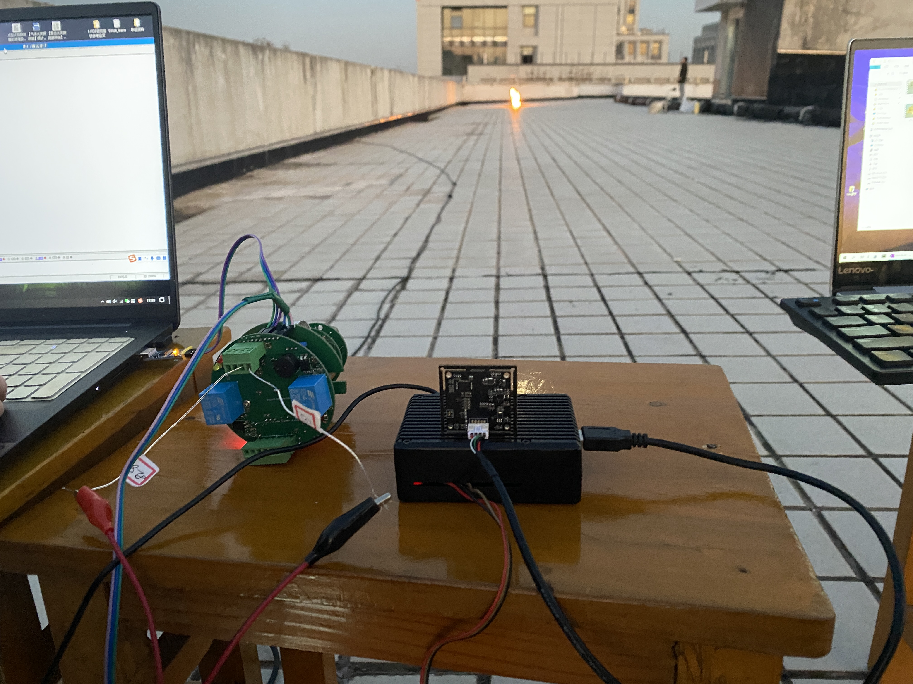
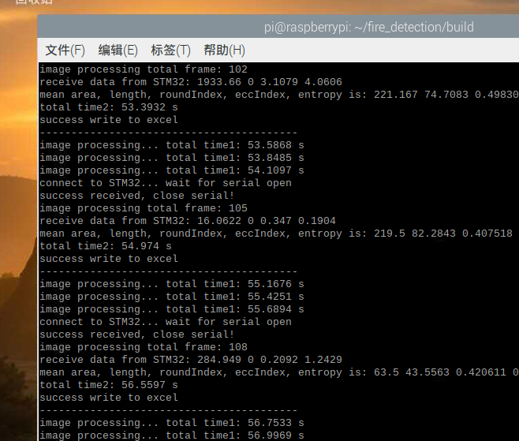

# fire detection for C++ and RaspberryPi-4B
2022.7.1-

## 简介
----------
**常规方法**
* 火焰检测1.0版
	* fireDetection.cpp
		* 对视频进行火焰检测
	* fireDetection-camera.cpp
		* 对摄像头进行实时火焰检测
* Simple-RasberryPi
  * 对摄像头进行实时火焰检测的树莓派编译版本---可以使用
* main.cpp
	* 目前的最新版本
----------
**级联分类器方法**
* fireCascade.cpp 8.17更新
  * 需要调用fireDetection.h头文件和cascade.xml模型
  * 级联分类器需要正样本和负样本，可以用Haar或LBP算法
  * 分类器由多个简单分类器按一定的顺序级联而成。级联中的每个阶段根据小规模的特征子集取得特征值，并根据这个特征值快速地判断，决定拒绝或接受这个目标。如果每个阶段的判断都比上一个阶段更加精确，使性能得到提升（增强），那么整个级联分类器都会增强。这种做法的主要优势在于，级联中前面的阶段只进行一些简单的测试，可以快速排除掉那些明显不属于指定类别的实例。在早期阶段将它们排除掉后，通过扫描图像搜索某类物体时，大多数待测试的子窗口都将不属于指定类别，因而可以提高整个级联分类器的速度。这样，只有少数窗口需要经过全部阶段才能得到接受或排除的结论。
  * OpenCV提供了CascadeClassifier类，调用该类中的方法detectMultiScale，对其预测结果detections画矩形框即可

## 部分代码说明
* 初始化日志模块 -2022.8
```cpp
// log setting
// https://github.com/amrayn/easyloggingpp
el::Configurations defaultConf;
defaultConf.setToDefault();
el::Loggers::reconfigureLogger("default", defaultConf);
el::Logger* defaultLogger = el::Loggers::getLogger("default");
```
* 轮廓提取，绘制凸包，计算面积、周长、圆形度、偏心度特征 -2022.11
```cpp
vector<vector<Point>>contours;
vector<Vec4i>hierarchy;
cv::findContours(mask, contours, hierarchy, RETR_LIST, CHAIN_APPROX_SIMPLE);
//cv::drawContours(frame, contours, -1, Scalar(0, 0, 255), 3);
vector<vector<Point>>hull(contours.size());	

int image_area = frame.rows * frame.cols;
for (size_t i = 0; i < contours.size(); i++)
{
	convexHull(contours[i], hull[i]);  	// caculate convexhull
	
	double area = contourArea(contours[i]);
	double length = arcLength(contours[i], true);
	double roundIndex = 4 * 3.1415926 * area / (length * length + 0.00001);

	if ((area > contours_ratio * image_area) && (roundIndex > round_low) 
		&& (length > cntlen_low) && (contours[i].size() > ellipse_low)){		
		Rect rect = boundingRect(contours[i]);
		//rectangle(frame, rect, (255, 0, 0), 5);
		
		RotatedRect box = fitEllipse(contours[i]);
		double ellipseA = box.size.height;
		double ellipseB = box.size.width;
		double eccIndex = sqrt(abs(pow(ellipseA, 2) - pow(ellipseB, 2))) / 2;  // 偏心度	
		
		string text = "Warning!";
		cv::Point origin;
		origin.x = frame.cols / 2;
		origin.y = frame.rows / 2;
		putText(frame, text, origin, FONT_HERSHEY_SIMPLEX, 1, Scalar(0, 0, 255), 1);
		//putText(frame, std::to_string(ent.val[0]), origin, FONT_HERSHEY_SIMPLEX, 1, Scalar(255, 0, 0), 1);
	}
}

// draw convexhull
for (size_t i = 0; i < contours.size(); i++)
{
	//drawContours(mask, contours, (int)i, Scalar(0, 0, 255));
	drawContours(frame, hull, (int)i, Scalar(255, 0, 0), 5);
}
```
* 计算图像的熵值 -2022.11.23
```cpp
//https://github.com/arnaudgelas/OpenCVExamples/blob/master/cvMat/Statistics/Entropy/Entropy.cpp
cv::Scalar Entropy(cv::Mat image)
{
	std::vector<cv::Mat> channels;
	cv::split(image, channels);
	int histSize = 256;
	float range[] = { 0, 256 };
	const float* histRange = { range };
	bool uniform = true;
	bool accumulate = false;
	cv::Mat hist0, hist1, hist2;
	cv::calcHist(&channels[0], 1, 0, cv::Mat(), hist0, 1, &histSize, &histRange, uniform, accumulate);
	cv::calcHist(&channels[1], 1, 0, cv::Mat(), hist1, 1, &histSize, &histRange, uniform, accumulate);
	cv::calcHist(&channels[2], 1, 0, cv::Mat(), hist2, 1, &histSize, &histRange, uniform, accumulate);

	//frequency
	float f0 = 0, f1 = 0, f2 = 0;
	for (int i = 0; i < histSize; i++){
		f0 += hist0.at<float>(i);
		f1 += hist1.at<float>(i);
		f2 += hist2.at<float>(i);	
	}

	//entropy
	cv::Scalar e;
	e.val[0] = 0;
	e.val[1] = 0;
	e.val[2] = 0;
	// e0=0, e1=0, e2=0;
	float p0, p1, p2;

	for (int i = 0; i < histSize; i++){
		p0 = abs(hist0.at<float>(i)) / f0;
		p1 = abs(hist1.at<float>(i)) / f1;
		p2 = abs(hist2.at<float>(i)) / f2;
		if (p0 != 0)
			e.val[0] += -p0 * log10(p0);
		if (p1 != 0)
			e.val[1] += -p1 * log10(p1);
		if (p2 != 0)
			e.val[2] += -p2 * log10(p2);
	}
	return e;
}
```

* 串口通信的简单实现，读取STM32发送的四个数据（依据空格分割）
```cpp
	WzSerialPort w;
	if (w.open("/dev/ttyS0", 115200, 0, 8, 1)){
		// w.send("helloworld ", 10);
		std::cout << "connect to STM32... wait for serial open" << std::endl;

		char buf[1024];   
		std::vector<double> receive_num; 
		while (true){
			memset(buf, 0, 1024);
			w.receive(buf, 1024);
			// cout << buf;			
			char delims[] = " ";
			char* result = NULL;
			char* ptr;
			double ret;
			result = strtok(buf, delims);	// 收到的字符串按空格作为割
			int i = 0;
			while (result != NULL) {
				// printf("result is \"%s\"\n", result);
				ret = strtod(result, &ptr);
				if (typeid(ret) == typeid(double)) {
					receive_num.push_back(ret);
					i++;
				}
				result = strtok(NULL, delims);

				if (i == 4) {
					// 读完四个数关闭串口，后续可以优化				
					cout << "success received, close serial!" << endl;
					w.close();
					return receive_num;				
				}
			}
		}
	}
```

## 已完成部分
* -2022.8 实现了摄像头、视频、图像三种检测模式的选择 
* -2022.8 实现了将检测日志打印并保存到myeasylog.log 
  * 程序运行需包含external_module
  * 包含打印日志的模块easylogging++库  
* -2022.11 实现了对火焰图像圆形度、偏心率、熵值等特征值的计算 
* -2022.11.22 实现了树莓派与电脑的串口通信  
  * 实现过程详见cpp/serial_demo文件夹
* -2022.11.24 实现了将火焰特征值保存到csv/excel文件中
* -2022.11.24 修改为每隔flag帧处理一次图像，减少计算量（抽帧处理 
* -2022.11.27 制作其他干扰对照组特征值的数据集 
* -2022.11.28 制作火焰特征数据集 
* -2022.11.28 将火焰和干扰项数据集整理为符合SVM训练格式的txt文件
* -2022.11.29 建立SVM模型，实现输入特征-->预测有火/无火 
  * 实现过程详见CppSVM文件夹
* -2022.12.2 将串口通信加入图像处理模块，两种任务轮流切换
  * 树莓派端接线：黑-GND，红-TX，棕-RX
  * STM32接线：紫-GND，绿-TX，蓝-RX	
  	 
	   
* -2022.12.2 基于vector容器算法计算每帧图像提取出的面积、周长、圆形度、偏心率、信息熵的均值  
  	   


## 待完成部分
* 树莓派结合STM32的数据和图像处理的特征，进行SVM模型预测
* 预测结果的值传回STM32


## 参考资料
* https://docs.opencv.org/4.x/df/d0d/tutorial_find_contours.html
* https://docs.opencv.org/4.x/d5/d04/samples_2cpp_2convexhull_8cpp-example.html#a12
* https://github.com/amrayn/easyloggingpp
* https://github.com/gbmhunter/CppLinuxSerial.git
* https://github.com/arnaudgelas/OpenCVExamples/blob/master/cvMat/Statistics/Entropy/Entropy.cpp
* https://www.csie.ntu.edu.tw/~cjlin/libsvm/
* https://blog.csdn.net/jsgaobiao/article/details/50202757
* https://www.bookstack.cn/read/Cpp_Concurrency_In_Action/README.md
