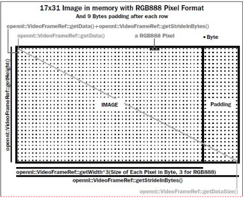
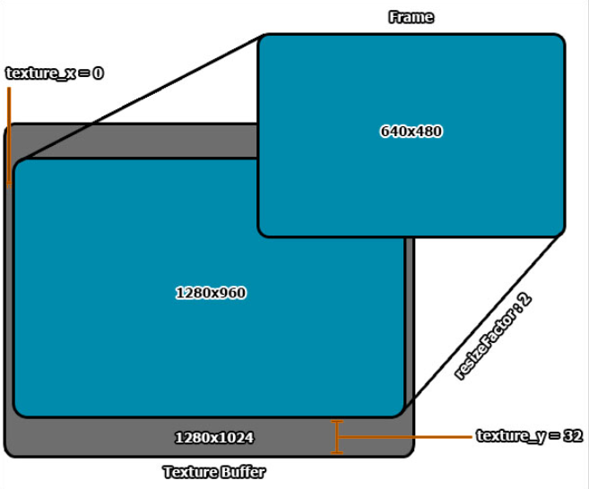

## OpenNI2 学习记录
* 2022.7.27- 起
* 更新进度：2022.8.5

----------

## 参考资料
* 参考书 **openni cookbook**
* https://structure.io/openni 各种环境的SDK下载
* https://github.com/structureio/OpenNI2 
* https://robots.uc3m.es/installation-guides/install-openni-nite.html linux版安装
* https://blog.csdn.net/weixin_44211644/article/details/126002688 linux环境搭建
* https://blog.csdn.net/weixin_44211644/article/details/126049773 linux版的cmake配置
* https://documentation.help/OpenNI-2.0/getting_started.html win版安装和vs配置
* https://blog.csdn.net/weixin_44211644/article/details/126055226 win版安装和vs配置

openni2的API说明文档：
* https://documentation.help/OpenNI-2.0/index.html
* https://s3.amazonaws.com/com.occipital.openni/OpenNI_Programmers_Guide.pdf
* https://developer.orbbec.com.cn/technical_library/OpenNI2/html/md__d_1_16_xE3_x80_x81_xE5_x9F_xBA_xE7_xA1_x80_s_d_k__open_n_i2_s_d_k_doc-new__open_n_i2_83-_s_d_k__doc_zh_0300__code_samples.html

奥比中光的SDK（不适用于Xtion）
* https://orbbec3d.com/index/download.html

OpenCV对深度相机的处理
* https://docs.opencv.org/4.6.0/d7/d6f/tutorial_kinect_openni.html 
* https://github.com/opencv/opencv/blob/3.4/samples/cpp/videocapture_openni.cpp
* https://docs.opencv.org/4.x/d2/d3a/group__rgbd.html

通过OpenNI2获取数据并转至OpenCV格式及点云生成
* https://blog.csdn.net/u014610460/article/details/80135843

其他参考资料
* https://github.com/AmmarkoV/RGBDAcquisition
* https://github.com/leaveitout/asus_xtion_intrinsic_calibration  用于校准 
* https://kheresy.wordpress.com/index_of_openni_and_kinect/documents-of-openni-2-x/

Primesense 传感器并将校准文件写入 InfiniTAM 格式的工具
* https://github.com/carlren/OpenNICalibTool

----------

## 学习记录

* open_default_camera.cpp
	- opencv 打开笔记本默认摄像头

* opennitest.cpp 
	- 测试openni环境是否搭建正常，能否打开摄像头

* test_device.cpp
	- 读取设备列表，包含设备id、制造商、usb、uri等信息

* getDataStream.cpp
	- 读取深度和彩色rgb信息流

* openni_convert_to_opencv 文件夹
	- 具体说明见文件夹中的README.md
	- 8.4起测试代码均放在此处

	- convert_to_opencv.cpp 
		- 将深度和彩色数据转换为OpenCV读取的格式并显示
		- 例如 const cv::Mat mImageDepth(frameDepth.getHeight(), frameDepth.getWidth(), CV_16UC1, (void*)frameDepth.getData());
		- 问题：程序运行卡死，画面静止不动
	- test.cpp
		- 8.4 测试 能否转成OpenCV格式进行基本的图像处理
		- 理论上没有问题，但是在我的电脑分辨率640x480时候卡死，无法运行；320x240正常
		- 参考自 https://kheresy.wordpress.com/2013/01/09/%e7%94%a8-opencv-%e7%95%ab%e5%87%ba-openni-2-%e7%9a%84%e6%b7%b1%e5%ba%a6%e3%80%81%e5%bd%a9%e8%89%b2%e5%bd%b1%e5%83%8f/

* Sample 文件夹-存放了openni官方的示例 bin 和源码 
	- 1_SimpleRead 文件夹 
		- 读取深度信息，单位mm
	- 2_SimpleViewer 文件夹  失败 // error C2065: “GL_GENERATE_MIPMAP”: 未声明的标识符
		- 
	- 3_Depth 文件夹
		- 实时显示depth模式的图像
	- 4_Color 文件夹
		- 实时显示color模式的图像
	- 5_Infrared 文件夹
		- 实时显示IR模式的图像
		- 但是显示全黑
	- 6_ClosestPointViewer 文件夹
		- 获取三维空间中最近点坐标  失败 // error C2065: “GL_GENERATE_MIPMAP”: 未声明的标识符

* openni_cookbook_code 文件夹
  * 来源-- https://www.packtpub.com/support/code-downloads

  * chapter2
	- 1_Basics 入门介绍
		- OpenNI::getVersion() 读取OpenNI版本 
		- status = OpenNI::initialize(); 确认OpenNI状态 
		- **bool HandleStatus(Status status) 判断OpenNI状态是否正常的函数**
    		- Status 是枚举类型，默认为0，即STATUS_OK
	- 2_ListOfDevices 读取设备列表
		- Array<openni::DeviceInfo> listOfDevices;
		- OpenNI::enumerateDevices(&listOfDevices);
		- DeviceInfo 类 
    		- 包含设备id、制造商、usb、uri等信息
	- 3_InitVideoStream **创建视频流**
		- Device 类
			- device.hasSensor(SensorTypre) 检查是否支持该设备读取深度信息
				- **其中SensorTypre是枚举类型，可以填写- - SENSOR_COLOR\SENSOR_DEPTH\SENSOR_IR，读取rgb、深度、ir三种信息**
		- VideoStream 类
			- sensor.create(device, SensorTypre) 创建视频流
		- VideoMode 类
			- 设置帧数、分辨率、深度格式精度等信息
			- sensor.setVideoMode(depthVM)
			- sensor.start() 创建连接
	- 3_2_VideoModes
		- 显示设备可能支持的VideoMode 分辨率、帧数等信息，并选择其中一种
	- 4_SelectDevice 选择指定设备（不重要，略）
	- 5_ListenToOpenNIEvents **监视设备连接和断开事件** （7.31 没怎么看懂）
		- struct OurOpenNIEventMonitorer 定义事件监视结构体
	- 6_OpenFileAsDevice **读取现有的ONI格式数据**，而不是通过摄像头
		- Deivce 类
			- device.open(addressOfFile) 打开oni文件

  * chapter3 Using Low-level Data
	- VideoFrameRef 类 OpenNI2.x版本中，只需这个类就可以读取传感器数据
	- **VideoFrameRef::getData() 返回这一帧图像第一个像素的未定义数据类型指针void***
	- **openni::VideoFrameRef::getStrideInBytes()  返回图像每一行的bytes数**
	- 
	- 需要配置 OpenGL 或 freeglut等 易于迁移到其他平台
	- 1_Color&IR  **读取颜色和IR红外光信息**
		- esc退出，C/c设置为color模式，I/i设置为IR模式
		- void SetActiveSensor(SensorType sensorType, Device* device) 切换现有模式
		- void gl_DisplayCallback() 清除opengl缓冲区，写入新数据，设置opengl显示的信息，构建 texture map 
			- 关键部分 double resizeFactor = min(.....)
			- 
	- 2_depth  **读取深度信息**	
		- esc退出，H/h设置直方图归一化，F/f设置阴影填充 ，C/c设置彩色模式
		- 深度信息 DepthPixel* depthCell
		- **遍历查找最大深度值 maxDepth 和最小深度值 minDepth**
		- 将depth信息转换为RGB，存放在 OniRGB888Pixel* texturePixel 中
		- histogram_enable 直方图归一化处理
		- color_enable 转换色彩空间，获取更多细节
		- blackfill_enable 阴影填充
	- 3_PlayControl 重放功能-略
	- 4_RecordToONI 记录至oni格式文件-略
	- 5_EventRead 事件读取数据的基本实现-略

  * chapter4 More about Low-level Outputs
	- 本章重点：深度和色彩图匹配 overlaying the depth frame over the image frame
	- openni::Device object 开启或禁用图像配准
		- This class contains methods to enable and disable depth and image frame syncing and depth-over-image registration. 
		- In other words, any enhancements that have an effect on two or more sensors are included with this class.
	- openni::VideoStream object 能够镜像或裁剪图片指定区域
		- Methods to enable the mirroring of frame data and the cropping of a specific area in frames are part of this class.
		- openni::VideoStreamis home to methods that are responsible for customizing each frame of data.
	- openni::CoordinateConverter **将深度像素位置和值转换为真实位置、距离或颜色**
		- If you want to convert the position and value of a depth pixel into the real-world position,distance, or color of that pixel, you need to start using theopenni::CoordinateConverterclass. 
		- This class is a standalone class that contains static methods for these sorts of operations.
	- 1_Cropping & Mirroring 裁剪、镜像操作-略
	- 2_FrameSync 同步图像和深度流-略
	- 3_DepthOverImage **深度和图像帧叠加**
		- device.getImageRegistrationMode 
		- 运行失败，空白不显示
	- 4_CenterDistanceInMillimeter **深度信息转化为mm值-重要!**
		- openni::CoordinateConverter 类 转换成真实世界的mm值
			- https://documentation.help/OpenNI-2.0/classopenni_1_1_coordinate_converter.html
			- https://kheresy.wordpress.com/2013/01/14/coordinate-converter-in-openni-2/
			- **static Status convertDepthToWorld(const VideoStream& depthStream, float depthX, float depthY, float depthZ, float* pWorldX, float* pWorldY, float* pWorldZ)** 
			- 从深度到世界坐标的转换在计算上是相对昂贵的。将整个原始深度图转换为世界坐标通常是不切实际的。更好的方法是让算法尽可能长时间地在深度坐标中工作，并且在输出之前仅将几个特定点转换为世界坐标。
	- 5_ColorOfNearestPixel
