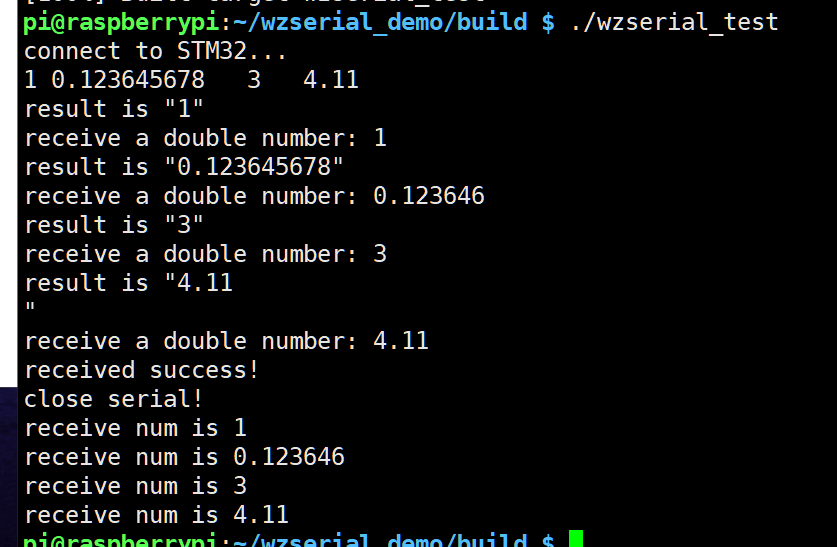

# WzSerialPort-demo
* 2022.11.27 @yaofanghao
* for Linux C++
* 本项目应用背景：树莓派和STM32之间串口通信的简单实现，收发火焰特征的数据并实现SVM模型预测

## 常见问题：
* 串口无法打开，可能是由于权限的问题，sudo一般可解决这个问题。
* 读串口的时候，有阻塞的现象，经测试，仅仅是Ubuntu18.04上出现来该问题，这可能是虚拟串口的原因，后续使用实际串口中如果仍有该问题，后续再更新..

* 12.1 修改，需要读取STM32发送的四个字符串数据，并按照数字读取
  * 程序运行结果如图所示
   

## 参考来源
* https://github.com/ayowin/WzSerialPort
* https://github.com/ayowin/WzSerialportPlus
* https://learn.microsoft.com/en-us/cpp/standard-library/string-functions
* https://blog.csdn.net/weixin_44353958/article/details/104156394
* https://blog.csdn.net/Touch_Dream/article/details/82915553
* https://blog.csdn.net/stone_fall/article/details/88640469

